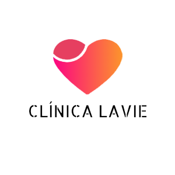
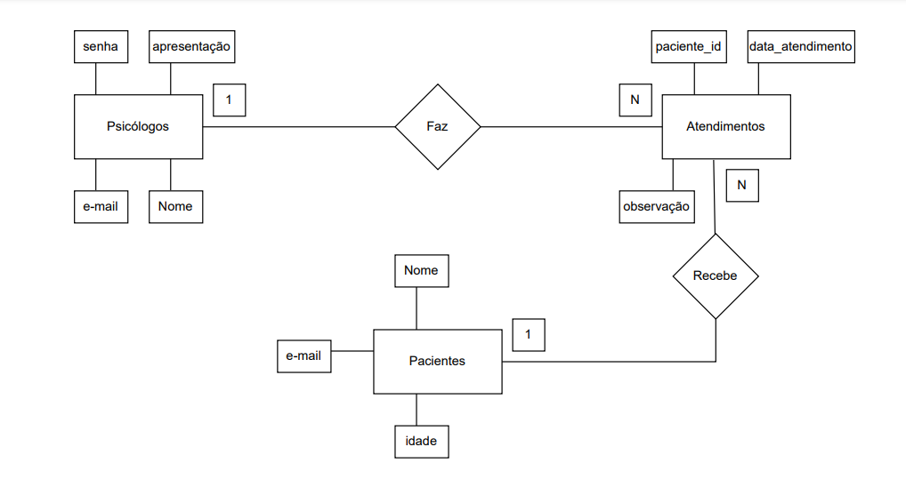
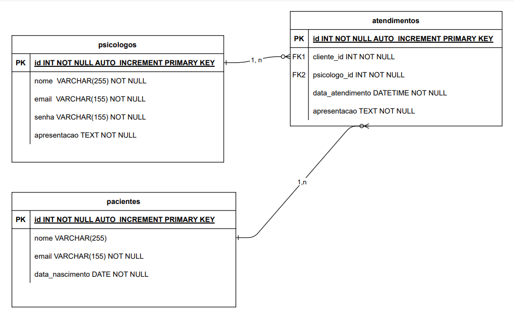

# API Clínica Lavie

A API Clínica Lavie é um sistema baseado em um consutório médico, com sistema de controle para os médicos/psicólogos, sistema usuários/pacientes e atendimentos, esta API faz parte de um projeto desenvolvido junto e oferecido pela Gama Academy Experience (Gama XP), experience 47.

## Tecnologias Utilizadas

Node.js;
Express;
Bando de dados MySQL.

As tecnologias utilizadas no projeto correspondem aos principais métodos e requisitos de execução ends points para execução CRUD para os seus devidos grupos de base dos dados da clínica Lavie.
## Organograma e projeto de dados 
## Organograma e dados do projeto 

## Documentação da API
Link com documentação completa abaixo:
